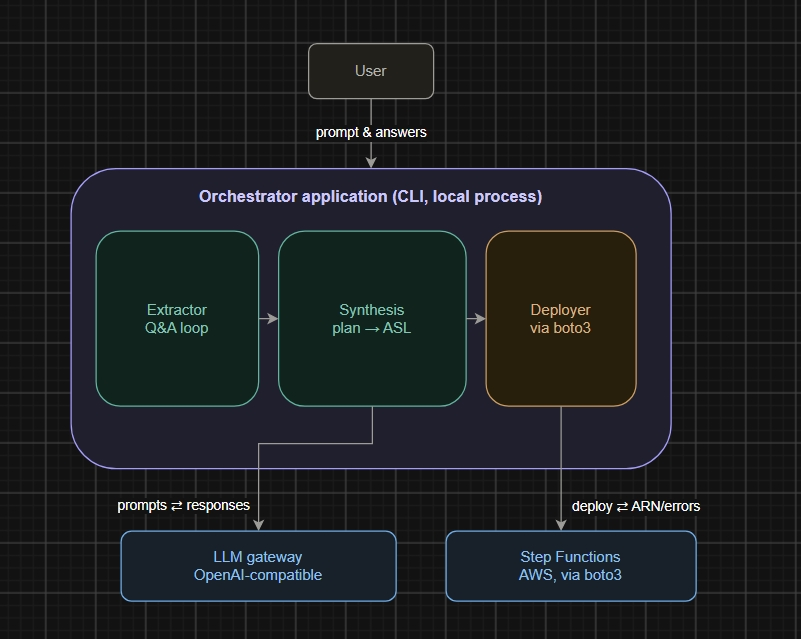
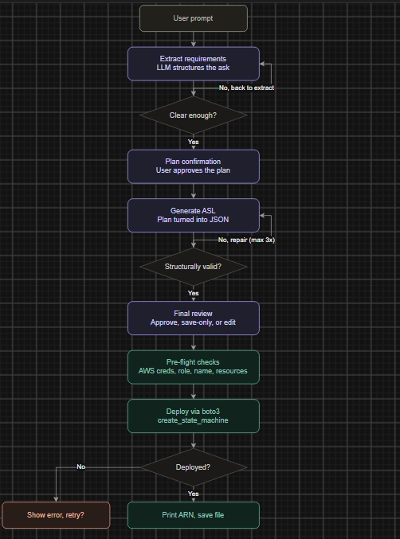
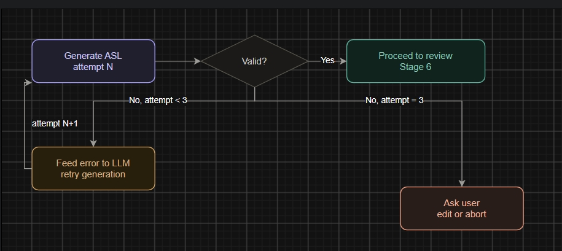
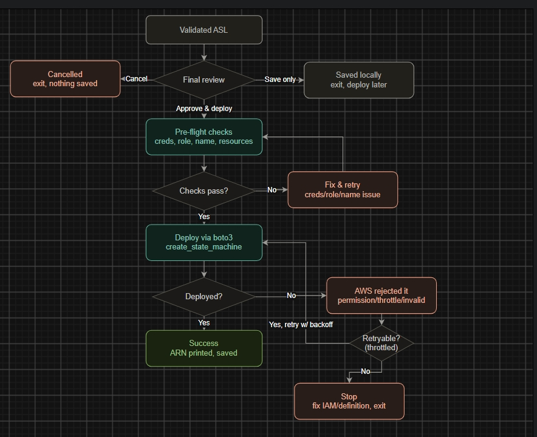

# Phase 1 architecture — prompt to deployed Step Function

Scope: user gives a natural-language prompt describing a workflow (steps,
Lambdas, use case) → system asks clarifying questions if unclear →
generates an Amazon States Language (ASL) definition → validates it →
user reviews → deploys via boto3.

Three process diagrams cover the flow end to end (below), plus one
system architecture diagram showing components and integrations.

---

## System architecture



```
                    User
                     │ prompt & answers
                     ▼
┌─────────────────────────────────────────────────────┐
│  Orchestrator application (CLI, local process)       │
│                                                       │
│  ┌───────────┐   ┌────────────┐   ┌───────────┐      │
│  │ Extractor │──▶│ Synthesis  │──▶│ Deployer  │       │
│  │ Q&A loop  │   │ plan → ASL │   │ via boto3 │       │
│  └───────────┘   └────────────┘   └───────────┘      │
└──────────┬───────────────────────────────┬───────────┘
           │ prompts ⇄ responses           │ deploy ⇄ ARN/errors
           ▼                               ▼
   ┌───────────────┐               ┌───────────────┐
   │  LLM gateway   │               │ Step Functions │
   │ OpenAI-compat  │               │ AWS, boto3     │
   └───────────────┘               └───────────────┘
```

Three internal components, one external LLM dependency, one external
AWS dependency. **Extractor** and **Synthesis** call the gateway for
chat completions only — the clarification loop asks the user directly
for Lambda names/ARNs instead of retrieving repo context, so this
feature has no vector store or embeddings dependency, and isn't blocked
on your gateway's embeddings support. `indexing/vectorstore.py` and
`retrieval/retriever.py` stay deferred until a later phase actually
needs repo-context enrichment. Only the **Deployer** talks to AWS, and
only after the human checkpoint in Diagram 3 (final review).

---

## Diagram 1 — Main flow (prompt → validated ASL)



```
User prompt
    │
    ▼
Extract requirements (LLM)  ◄──┐ asks follow-up questions
    │                          │ (loops back with fuller context)
    ▼                          │
Clear enough? ──── No ─────────┘
    │ Yes
    ▼
Plan confirmation (user approves)
    │
    ▼
Generate ASL (LLM)  ◄──┐ repair loop, see Diagram 2
    │                  │
    ▼                  │
Structurally valid? ── No, retry (max 3x)
    │ Yes
    ▼
Final review  →  see Diagram 3
```

### Stage 1 — Prompt intake
User runs `orchestrator generate "<prompt>"` (or an interactive mode).
The prompt plus a running conversation history (starts empty) go to the
Requirement Extractor.

### Stage 2 — Requirement extraction (LLM call)
The LLM is asked to extract a structured requirement set: workflow
name/purpose, ordered steps with types (Task/Choice/Wait/Parallel/
Succeed/Fail), AWS service + identifying info per Task step, branching
logic, error-handling expectations.

**Use structured output, not free text.** Ask the model to always
return one of two JSON shapes, and branch on a `status` field:

```json
{
  "status": "needs_clarification",
  "questions": [
    "How many Lambda functions are involved, and what are their names or ARNs?",
    "Should the workflow retry a failed step, or fail immediately?"
  ],
  "partial_understanding": "You want a workflow that processes uploaded files and notifies on completion."
}
```
```json
{
  "status": "ready",
  "plan": {
    "name": "process-uploaded-file",
    "summary": "Reads a file from S3, validates it, and notifies on success or failure.",
    "steps": [
      {"name": "ValidateFile", "type": "Task", "service": "Lambda", "description": "Validates the uploaded file format"},
      {"name": "NotifySuccess", "type": "Task", "service": "SNS", "description": "Sends success notification"},
      {"name": "NotifyFailure", "type": "Task", "service": "SNS", "description": "Sends failure notification"}
    ]
  }
}
```

Code becomes trivial branching, no text-parsing:
```python
if response["status"] == "needs_clarification":
    ask_the_user(response["questions"])
else:
    proceed_with_plan(response["plan"])
```

System prompt guidance that matters: tell the model to ask about real
gaps (missing Lambda names, ambiguous branching) but *not* to nitpick
things it can default sensibly (exact timeout values) — instead state
assumptions explicitly when it defaults something.

### The clarification loop, concretely
Each LLM call is stateless — the full conversation must be resent every
round:
```python
conversation = [
    {"role": "user", "content": "I want a workflow that processes uploaded files"},
    {"role": "assistant", "content": "How many Lambdas? What should happen on failure?"},
    {"role": "user", "content": "2 Lambdas: validate and notify. On failure, just notify, don't retry."}
]
```
Loop with a safety cap:
```python
MAX_ROUNDS = 5
round_count = 0
while True:
    response = extract_requirements(conversation)
    if response["status"] == "ready":
        break
    round_count += 1
    if round_count >= MAX_ROUNDS:
        break  # offer: proceed with assumptions, or abort
    show_questions_to_user(response["questions"])
    answer = get_user_input()
    conversation.append({"role": "assistant", "content": str(response["questions"])})
    conversation.append({"role": "user", "content": answer})
```

Edge cases:
- **User types "skip"/"use defaults"** — instruct the model to state its
  assumptions explicitly in its next response so nothing is silently
  guessed; those assumptions surface at Stage 3 for the user to see.
- **Round cap hit** — offer "proceed with assumptions" or abort, don't
  loop forever.
- **User cancels** (Ctrl+C / "cancel") — graceful exit, nothing saved.
- **Contradicting answers across rounds** (e.g. "3 Lambdas" then later
  "actually 4") — resolved naturally because the model sees the *whole*
  conversation history each round, not just the latest message.
- **Out-of-scope prompt** (e.g. "delete all my S3 buckets") — extractor
  should recognize this isn't a Step Function build task and say so.

### Stage 3 — Plan confirmation
CLI displays the structured plan. User: **approve** / **request
changes** / **cancel**. Changes or cancel loop back into Stage 2 with
feedback appended to the conversation.

### Stage 4 — ASL generation (LLM call)
Approved plan + repo context → LLM generates raw ASL JSON. Instruct it
explicitly: *"Output ONLY a JSON object, no prose, no markdown fences."*
Strip fences in code as a safety net regardless — models add them by
default surprisingly often.

### Stage 5 — Structural validation
Pure Python, no AI. Recurses rather than only checking the top level,
since a `Parallel` branch or `Map`'s `ItemProcessor` is its own nested
`StartAt`/`States` state machine:
1. `StartAt` exists and names a real state.
2. Every state has an allowed `Type` (Task/Choice/Wait/Parallel/**Map**/Succeed/Fail).
3. Every non-terminal state has `Next` (pointing to a real state) or
   `End: true`.
4. Checks 1–3 apply again inside every `Parallel` branch and every
   `Map`'s `ItemProcessor`. `Choice` states don't nest a full state
   machine, but each `Choices` entry's own `Next` is validated the
   same way a plain `Next` is.

If it fails, this feeds into the repair loop — see Diagram 2.

---

## Diagram 2 — ASL validation repair loop



```
Generate ASL (attempt N)
    │
    ▼
Valid? ── Yes ──► Proceed to review (Stage 6 / Diagram 3)
    │
    No, attempt < 3
    │
    ▼
Feed error to LLM ──► regenerate (attempt N+1, loop to top)
    │
    No, attempt = 3
    ▼
Ask user: edit or abort
```

**Why regenerate-with-context instead of "just try again"**: feeding the
exact validation error back lets the model patch the specific problem
instead of regenerating blind:
```python
repair_prompt = f"""
The ASL you generated failed validation with this error:
"{validation_error}"

Here is the broken definition:
{broken_json}

Fix ONLY the specific problem described above. Keep everything else
the same. Return the corrected JSON, nothing else.
"""
```
This is just another call to the same `chat_completion()` function,
different prompt.

**Why cap at 3**: if it can't fix something in 3 tries, more retries
rarely help — the issue is more likely with the plan than the JSON
syntax. It also bounds gateway cost and wait time. Tune this number
once you see real failure patterns.

**Malformed-JSON case**: if the LLM's response isn't valid JSON at all
(parse error before validation even runs), treat that as a validation
failure too — same repair loop, same cap — rather than crashing.

---

## Diagram 3 — Final review and deployment outcomes



```
Validated ASL
    │
    ▼
Final review ──── Save only ────► Saved locally (exit, deploy later)
    │
    ├──── Cancel ────► Cancelled (exit, nothing saved)
    │
    │ Approve & deploy
    ▼
Pre-flight checks ── No ──► Fix & retry ──► (loop back to checks)
    │ Yes
    ▼
Deploy via boto3
    │
    ▼
Deployed? ── Yes ──► Success: ARN printed, definition saved
    │
    No
    ▼
AWS rejected it (permission / throttle / invalid definition)
    │
    ▼
Retryable (throttled)? ── Yes ──► retry w/ backoff (loop back to deploy)
    │
    No
    ▼
Stop: fix IAM/definition, exit
```

### Stage 6 — Final review
Why this stage exists: structural validity ≠ correctness. The validator
confirms the JSON is well-formed Step Functions syntax — it says
nothing about whether it's the *right* workflow. A human has to look at
it. Options: **approve & deploy** / **save only** / **request changes**
(loop back to Stage 3 or 4) / **cancel**.

**Save only** writes a workflow bundle, not bare ASL — `{"plan": ...,
"asl": ..., "conversation": ..., "created_at": ...}`. `deploy` reads
`asl` from it; keeping the plan and conversation alongside it means a
saved bundle can be reopened and fed back into the extractor/generator
for edits later, instead of starting over from a context-less ASL file.

### Stage 7 — Pre-flight checks
Four checks before any deployment call is made:
1. **Credentials resolvable** — can `boto3.Session()` find credentials
   at all (env vars, `~/.aws/credentials`, named profile)? Catching
   this here avoids a cryptic auth exception mid-deploy.
2. **Role ARN well-formed** — does
   `STEP_FUNCTIONS_EXECUTION_ROLE_ARN` look like a real ARN
   (`arn:aws:iam::<account>:role/<name>`)? Cheap string check, catches
   common typos before an AWS round-trip.
3. **Name collision** — `list_state_machines()` (read-only) to check if
   the name already exists. Phase 1 is create-only, so a collision is
   always a hard stop here — offer a rename, never silently overwrite.
4. **Resource existence (best-effort, non-blocking)** — for each Task
   state's `Resource` ARN, attempt `lambda.get_function()` (or the
   equivalent for other services) and **warn**, don't block, on
   failure — permission scoping and cross-account setups can produce
   false negatives, and the user has already reviewed and approved the
   definition by this point.

### Stage 8 — Deployment and error categorization
The call itself: `client.create_state_machine(name=..., definition=...,
roleArn=...)`. What matters is categorizing the failure, since "retry"
isn't the right answer for everything:

- **Permission denied** (`AccessDeniedException`) — not retryable; the
  role genuinely lacks permission. Surface AWS's specific message and
  stop.
- **Throttling** (`TooManyRequestsException`) — transient, safe to
  retry with backoff (the same `tenacity` pattern already used in
  `gateway_client.py`).
- **AWS's own ASL validation rejects it** (`InvalidDefinition`) — this
  means AWS caught something the local `validator.py` missed (it's a
  simpler structural check, not a full ASL schema validator). Route
  this back into **Diagram 2's repair loop** with AWS's specific error
  message — don't just dump it on the user as a dead end.

---

## Design pattern that repeats across every stage

1. **Structured output over free text** — the model commits to a JSON
   shape your code can branch on, never prose you have to parse.
2. **A capped retry loop with the specific error fed back in** — used
   for clarification (Stage 2), ASL repair (Diagram 2), and pre-flight
   fixes and throttle retries (Diagram 3).
3. **A human checkpoint before anything irreversible** — Stage 6's
   final review always happens before Stage 8's actual AWS deployment
   call.

**Testing these loops:** `validator.py` and `chunker.py` are pure
functions — plain unit tests. The clarification and repair loops
involve real LLM calls, so mock `gateway_client.chat_completion()` with
`pytest-mock` (already in `requirements.txt`) and script the responses
— e.g. a `needs_clarification` response followed by a `ready` response
— to assert the loop terminates and the conversation history builds
correctly, without hitting the gateway in CI.

---